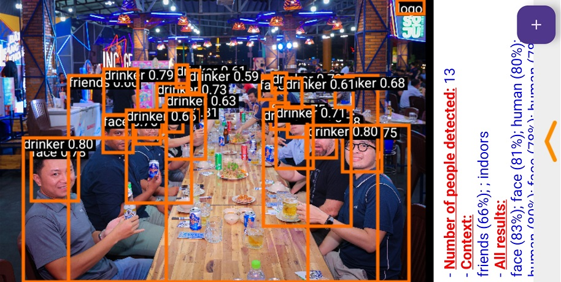

Heineken Product Classifier App

1. Introduction:

Welcome to the Heineken Product Detection App project! This app helps users quickly and accurately identify and detect Heineken products. Leveraging advanced AI technology, the app enhances user experience by providing detailed information about Heineken's beer and beverage products.

This is the application I developed for the AngelHack 2024 competition in Ho Chi Minh City.

  
  
or you can see more [here.]([Demo/Project_Heniken_aio_06.pdf](https://github.com/LittleKai/HeinekenObjDetectionApp/blob/main/Demo/Project_Heniken_aio_06.pdf))

2. Key Features:
   
•	Product Detection: Identify and detect Heineken products including beer, beverages, and other items. The total number of detectable classes is 60. You can view the list of classes [here](Demo/label.txt).

•	Detailed Information: Provide detailed information about each product, including ingredients, origin, and related details.

•	Community Interaction: Encourage user engagement and product sharing within the Heineken community.

3.	Installation:

•	Download the application from Google Drive:
https://drive.google.com/file/d/1n_prUJRjVh_YmWB2nVhG7E7BypGkzV4q/view

**Note: After granting permissions on first app use, you may need to restart the app.

•	Install the downloaded APK on your Android Smartphone.

4. References:

•	Tensorflow

•	Android Studio

Contributions:
We welcome contributions from the community. If you have any suggestions or find any issues, please open an issue or submit a pull request to this repository.

Link demo video:
https://youtu.be/eKEXYq2gVTA

